# Resume Screening System Using NLP
## 👨‍💻 Developed By
Bhatraju Sailu (Team Lead)
## 📌Project Description
Developed an automated Resume Screening System using NLP and Machine Learning to extract key skills,experience,qualification, analyze resumes, and generate ATS scores for candidate ranking.
## 🚀Features
- Resume Parsing
- Skill Extraction
- Machine Learning Based Ranking
- ATS Score Prediction (0–100)
- Candidate Classification (Standard / Competitive / Premium)
## 🛠️Technologies Used
- Python
- Scikit-learn
- XGBoost
- NLP (NLTK / spaCy)
- Pandas, NumPy
- React (Frontend)
- Node js(backend)
- PostgreSQL(data base)
- Cursor(Development Environment)
# 📂 Project Structure
- frontend/
- backend/
- dataset/
- ml service
- model/
- app.py
## System Modules
- Resume Parser
- NLP Matching Engine
- Ranking System
- Candidate Dashboard
- Recruiter Dashboard
- Admin Dashboard
## ▶️How to Run
1. Install dependencies
- pip install -r requirements.txt
2. Run the project:
- Run backend
- Run Frontend
- Run ml-service
- python app.py
- Open frontend and upload resume
3. Upload resume and view results
## 📊 Output
- Ranking Score (0–100)
- Candidate Tier (Standard / Competitive / Premium)
## 📸 Screenshots
### Candidate Login
 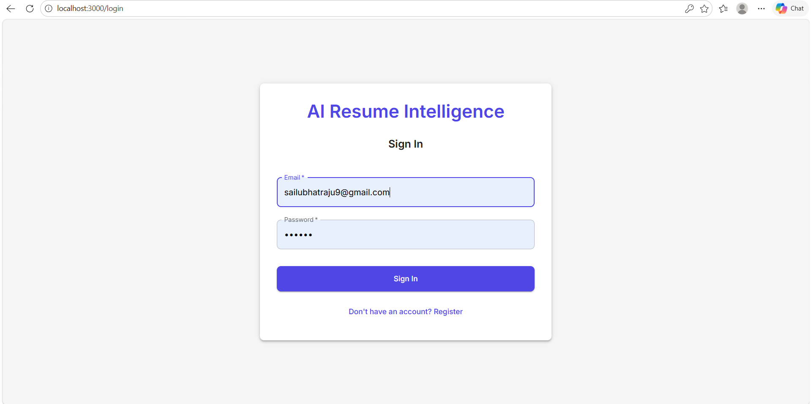

- ## Candidate Dashboard
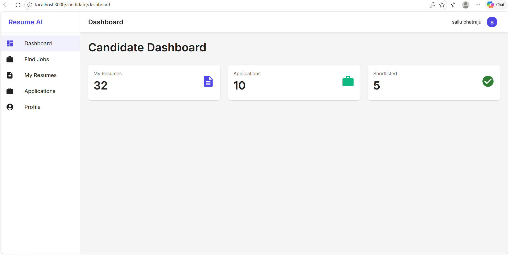

- ## Candidate Job Postings
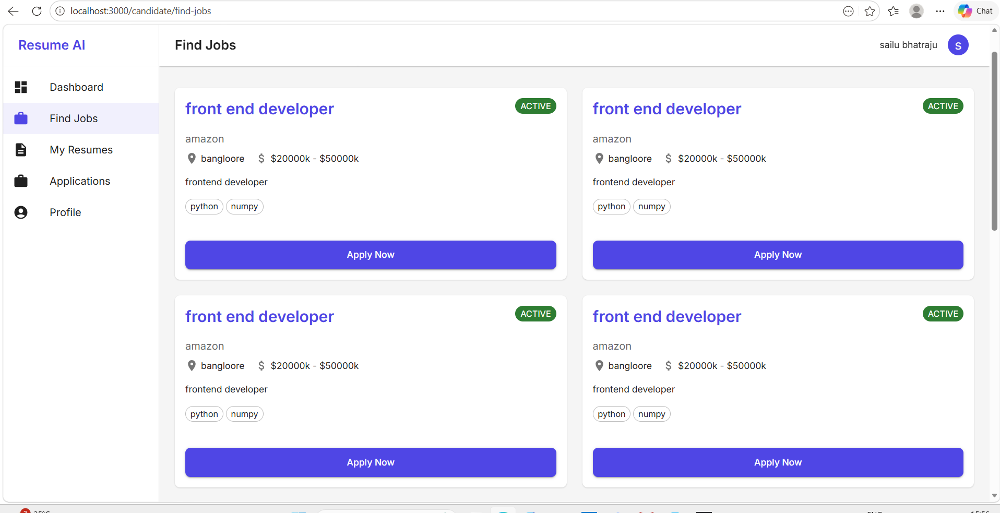
- ## Candidate Resumes
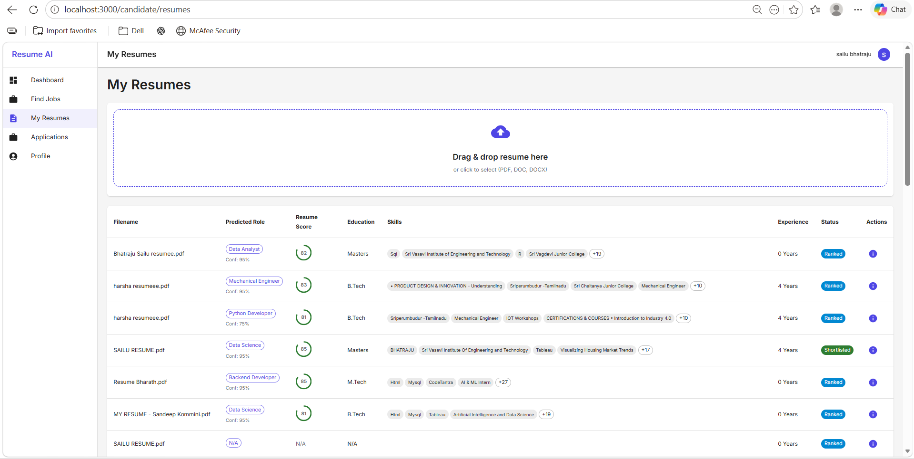
- ## Candidate Applications
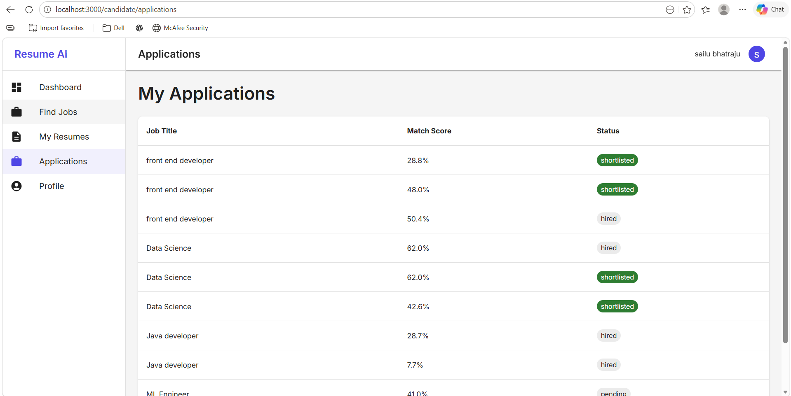
Markdown
## Recruiter Login
- ## Recruiter Dashboard
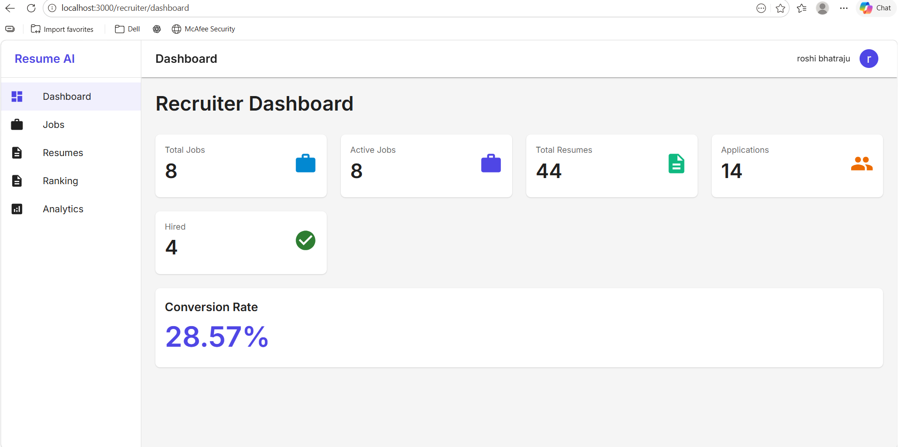

- ## Recruiter Jobs
 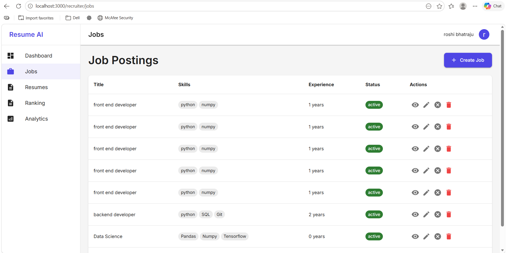

- ## Resumes
 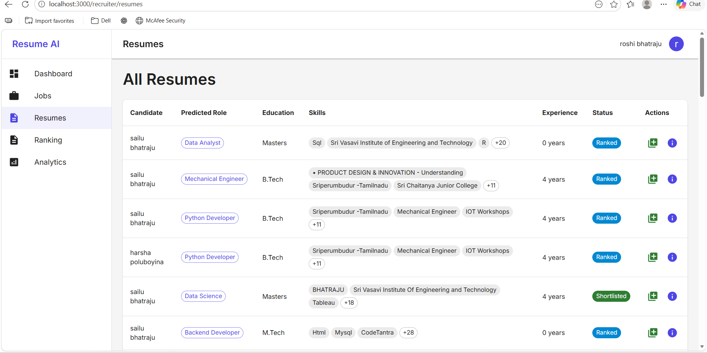

- ## Ranking
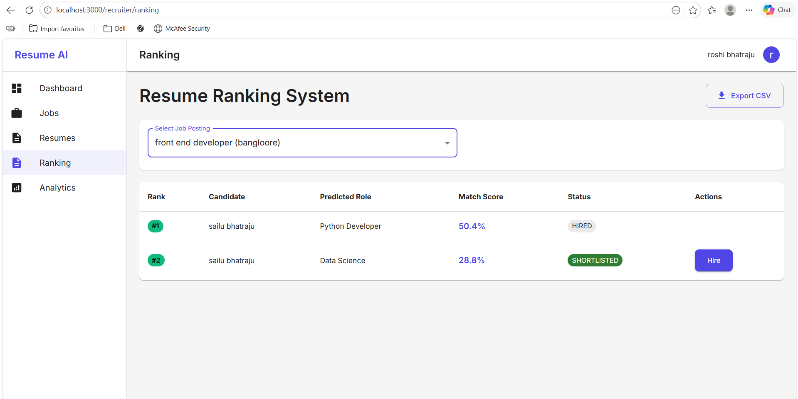

- ## Analytics
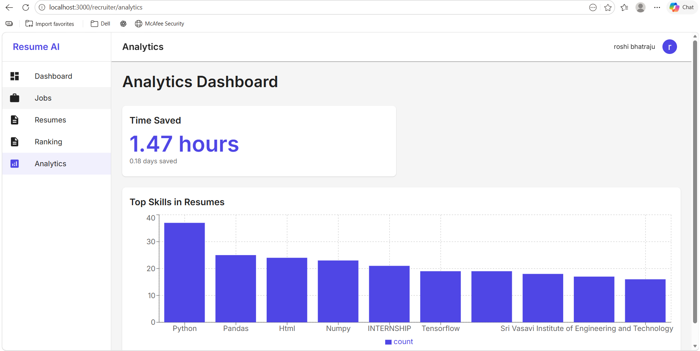

Markdown
## Admin Login
- ## Admin Login Page
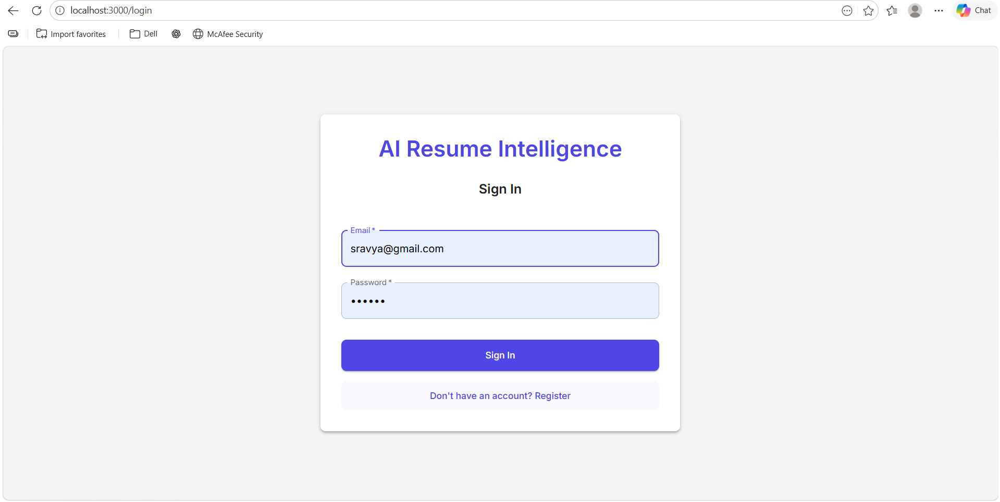

- ## Admin Dashboard
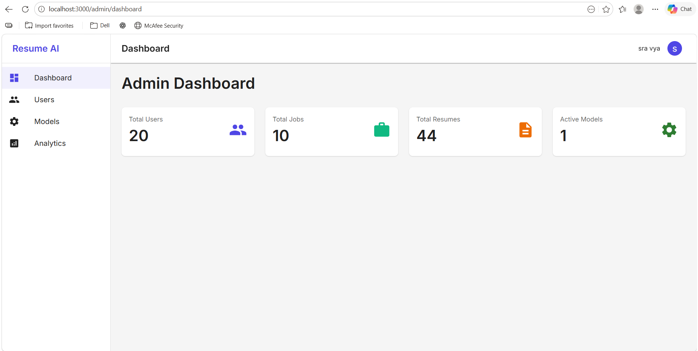

- ## User Management
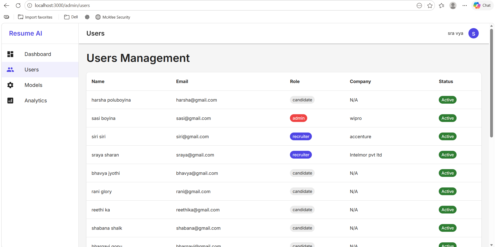

- ## Model Management
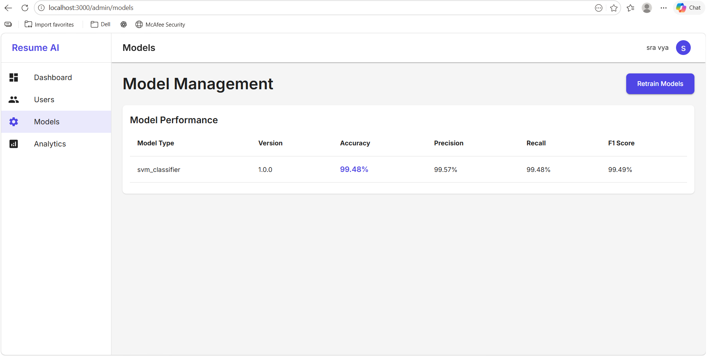

- ## System analytics
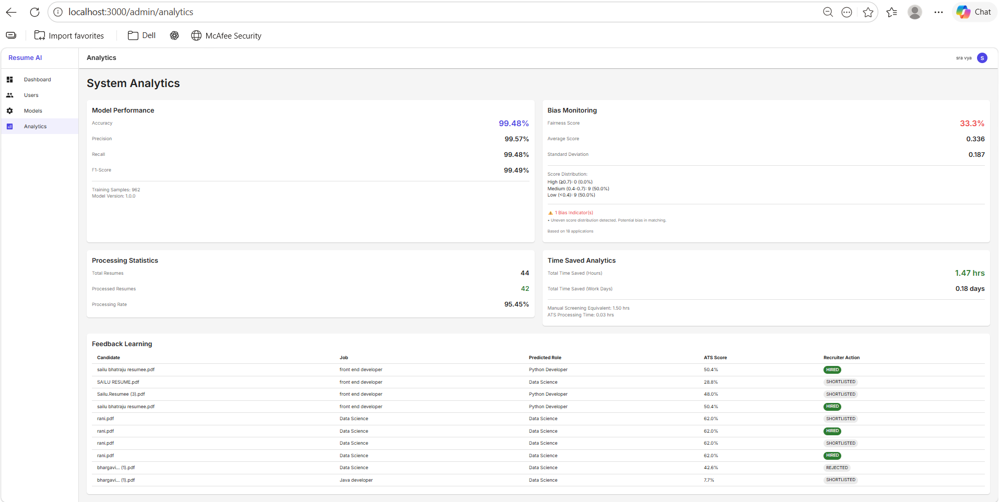

## 📚 Future Enhancements
- AI-based recommendation system
- Real-time job matching
- Web deployment
 ## License
- 
- 
- 
- 
- 
- 
- 
- 
MIT License
## 👨‍💻 Author
BHATRAJU SAILU
